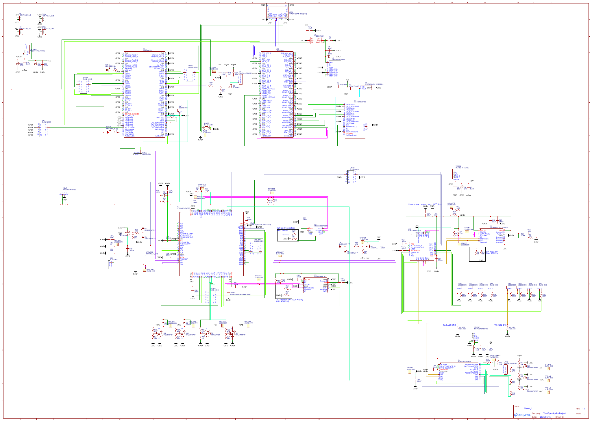
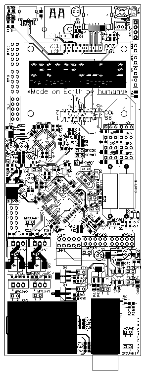

# OpenApolloV2
Repository for OpenApollo V2

The OpenApollo Project strives to lower the barrier of entry for beginners into the world of amateur rocketry and aviaton, by supplying an open-sourced platform, which solves the hardest and most intimidating parts of designing a fast, reliable and redundant circuit.

Designing the flight controller of a rocket is often the most intimidating parts of such a project, as it needs to be absolutely foolproof. It requires in-depth knowledge to make a high-speed servo-gyro feedback loop for flight stabilization, implement redundancy and failure handling, and have it be able to work in harsh conditions.

OpenApollo V2 provides a pre-built, open-sourced platform to make one of the most difficult parts of amateur rocketry more tolerable. Designing low-level control is incredibly difficult for beginners, and OpenApollo solves this by doing that for you, while also providing a Raspberry Pi CM5, which communicates directly with the low-level hardware, making it possible to control an entire flight with easy, high-level code written on the CM5. This separation keeps time-critical control on the microcontroller while allowing complex guidance, navigation, telemetry, or complex algorithms/ML/MV to run on a powerful Linux computer 

V2 upgrades the following from V1:
 - Better and smaller PCB size
 - Faster sensor feedback loops, due to low-level control
 - Easier connectivity for optional external sensors
 - More seperation between high-level and low-level parts, so beginners have to look into low-level parts as little as possible

V2 features the following parts:
 - I3G4250DTR Gyroscope
 - H3LIS200DLTR Accelerometer
 - MS561101BA03-50 Barometer and temperature sensor
 - STM32L412KBT6 as the Servo Feedback Controller [SFC]: Communicates with gyroscope and controls servo motors
 - STM32F745VET6 as the Master Peripheral Controller [MPC]: Communicates with GPS, Barometer, Accelerometer, SFC, Raspberry Pi CM5, and operates 4 high-power MOSFET switches
 - STM32G030F6P6 as a Flight Termination Controller [FTC]: Listens for heartbeats from both STMs, and the CM5, and can reboot both STMs, or trigger emergency protocols, icnluding controlling 3 MOSFET switches
 - Raspberry Pi CM5 running Linux, which can be used for resource-intensive calculations, and to set a flight path or protocols with easy, high-level code
 - HC-12 for telemetry (range can be increased greatly with an optimal 1/4th wavelength antenna)

oshwlab (has not been approved yet, though I'm not sure whether that's even needed):
https://oshwlab.com/ttomiz/project_hppayogv

Bill of materials:
|ID |Name                        |Designator                                                                                                                                                   |Footprint                           |Quantity|Manufacturer Part    |Manufacturer                |Supplier |Supplier Part      |Price |
|---|----------------------------|-------------------------------------------------------------------------------------------------------------------------------------------------------------|------------------------------------|--------|---------------------|----------------------------|---------|-------------------|------|
|1  |HDR-F-2.54_1x2              |5V,GND0,GND1,HV                                                                                                                                              |HDR-F-2.54_1X2                      |4       |                     |                            |LCSC     |C49661             |0.065 |
|2  |B2B-PH-K-S                  |BAT                                                                                                                                                          |CONN-TH_B2B-PH-K-S                  |1       |B2B-PH-K-S           |JST                         |LCSC     |C20504437          |      |
|3  |100nF (104M)                |C1,C2                                                                                                                                                        |C0805                               |2       |                     |                            |         |                   |      |
|4  |10uF                        |C3,C4,C16,C20,C21                                                                                                                                            |C0805                               |5       |                     |                            |         |                   |      |
|5  |100uF                       |C5                                                                                                                                                           |CAP-D5.0×F2.0                       |1       |                     |                            |         |                   |      |
|6  |0.1uF                       |C7,C15,C24,C25,C36,C45                                                                                                                                       |C0805                               |6       |                     |                            |         |                   |      |
|7  |10uF                        |C8,C9,C32,C43,C44                                                                                                                                            |CAP-D5.0×F2.0                       |5       |                     |                            |         |                   |      |
|8  |22pF                        |C10,C11                                                                                                                                                      |RAD-0.1                             |2       |                     |                            |         |                   |      |
|9  |100nF                       |C12,C13,C14,C17,C22,C26,C27,C28,C29,C30,C31,C34,C35,C39,C42,C46                                                                                              |C0805                               |16      |                     |                            |         |                   |      |
|10 |10nF                        |C18                                                                                                                                                          |C0805                               |1       |                     |                            |         |                   |      |
|11 |470nF                       |C19                                                                                                                                                          |C0805                               |1       |                     |                            |         |                   |      |
|12 |100nF                       |C23                                                                                                                                                          |C1206                               |1       |                     |                            |         |                   |      |
|13 |47uF                        |C33                                                                                                                                                          |CAP-D4.0×F1.5                       |1       |                     |                            |         |                   |      |
|14 |1uF                         |C37,C40                                                                                                                                                      |C0805                               |2       |                     |                            |         |                   |      |
|15 |22uF                        |C38,C41                                                                                                                                                      |C0805                               |2       |                     |                            |         |                   |      |
|16 |1N5819HW-7-F                |D1,D2,D3,D4                                                                                                                                                  |SOD-123_L2.7-W1.6-LS3.7-RD          |4       |1N5819HW-7-F         |DIODES(美台)                  |LCSC     |C82544             |0.057 |
|17 |ES3G                        |D5,D6                                                                                                                                                        |SMC_L7.1-W6.2-LS8.1-RD              |2       |ES3G-C               |FMS(美丽微)                    |LCSC     |C163764            |0.055 |
|18 |ZL262-2SG                   |FTC5V0,FTCBOOT,FTCHV0,FTCHV1,FTCRST,GPSUART,HCUART,MPC5V0,MPC5V1,MPCBOOT,MPCHV0,MPCHV1,MPCI2C1,MPCI2C2,MPCIO2,MPCRST,MPCUART,PWR,SFCBOOT,SFCI2C,SFCINT,SFCRST|HEADER 1X2 FEMALE AG4               |22      |                     |                            |         |                   |      |
|19 |ZL262-4SG                   |GPS,RPIO2                                                                                                                                                    |TUSKESOR_ALJZET_4_LABU_ZL262-4SG    |2       |                     |                            |         |                   |      |
|20 |PM254-1-05-W-8.5            |HC,LINK1,VOUT                                                                                                                                                |HDR-TH_5P-P2.54-H-F-W10.0-N         |3       |PM254-1-05-W-8.5     |HCTL(华灿天禄)                  |LCSC     |C2897387           |0.126 |
|21 |ZL262-10DG                  |LINK0,MPCIO0,MPCIO1,RPIO0,RPIO1,SET                                                                                                                          |ZL262-10DG                          |6       |                     |                            |         |                   |      |
|22 |HDR-M-2.54_1x1              |MPCVREF                                                                                                                                                      |HDR-M-2.54_1X1                      |1       |                     |                            |LCSC     |C81276             |0.013 |
|23 |LED-0805_G                  |NACT                                                                                                                                                         |LED0805_GREEN                       |1       |NCD0805G1            |国星光电                        |         |C84260             |0.023 |
|24 |LED-0805_R                  |NPWR                                                                                                                                                         |LED0805_RED                         |1       |17-21SURC/S530-A3/TR8|EVERLIGHT(台湾亿光)             |         |C72037             |0.025 |
|25 |K4-6×6_TH                   |PWRB                                                                                                                                                         |KEY-TH_4P-L6.0-W6.0-P4.50-LS6.5     |1       |K2-1102DP-E4SW-04    |韩国韩荣                        |LCSC     |C136684            |0.054 |
|26 |AO3400A                     |Q1,Q2,Q3                                                                                                                                                     |SOT-23-3_L2.9-W1.3-P1.90-LS2.4-BR   |3       |AO3400A              |AOS                         |LCSC     |C20917             |0.085 |
|27 |IRL530NPBF                  |Q4,Q5,Q6,Q7                                                                                                                                                  |TO-220-3_L10.0-W4.5-P2.54-L         |4       |IRL530NPBF           |Infineon(英飞凌)               |LCSC     |C85005             |1.035 |
|28 |IRLL110TRPBF                |Q8,Q9,Q10                                                                                                                                                    |SOT-223_L6.5-W3.5-P2.30-LS7.0-BR    |3       |IRLL110TRPBF         |VISHAY(威世)                  |LCSC     |C128228            |0.946 |
|29 |15k                         |R1                                                                                                                                                           |R0805                               |1       |                     |                            |         |                   |      |
|30 |1k                          |R2,R3                                                                                                                                                        |R0805                               |2       |                     |                            |         |                   |      |
|31 |0R                          |R4,R8,R9,R16,R17,R20,R21                                                                                                                                     |R0805                               |7       |                     |                            |         |                   |      |
|32 |10k                         |R5,R10,R18,R22,R24,R27,R29,R30,R31,R32,R37,R38,R39,R51                                                                                                       |R0805                               |14      |                     |                            |         |                   |      |
|33 |4.7k                        |R6,R7,R12,R13,R14,R15                                                                                                                                        |R0805                               |6       |                     |                            |         |                   |      |
|34 |100R                        |R11,R26,R52                                                                                                                                                  |R0805                               |3       |                     |                            |         |                   |      |
|35 |47R                         |R19,R23,R28,R33,R34,R35,R36,R40,R41,R42                                                                                                                      |R0805                               |10      |                     |                            |         |                   |      |
|36 |1M                          |R25                                                                                                                                                          |R0805                               |1       |                     |                            |         |                   |      |
|37 |220R                        |R43,R44,R45,R46,R47,R48,R49,R50                                                                                                                              |R0805                               |8       |                     |                            |         |                   |      |
|38 |0.1-0.25R                   |SHUNT0,SHUNT1                                                                                                                                                |R_AXIAL-1.0                         |2       |                     |                            |         |                   |      |
|39 |ZL262-3SG                   |SR0,SR1,SR2,SR3,SR4,SR5,SR6,SR7                                                                                                                              |HDR-F-2.54_1X3                      |8       |ZL262-3SG            |CONNFLY                     |Kosmodrom|00-00040667        |      |
|40 |HX HDMI 19PIN               |U2                                                                                                                                                           |HDMI-SMD_HX-HDMI-19PIN              |1       |HX HDMI 19PIN        |hanxia(韩下)                  |LCSC     |C5184845           |0.139 |
|41 |DS1095-05-LNR0              |U3                                                                                                                                                           |DS1095-05-LNR0                      |1       |DS1095-05LNR0        |Connfly electronic (Zhenqin)|         |                   |      |
|42 |STM32G030F6P6               |U4                                                                                                                                                           |TSSOP-20_L6.5-W4.4-P0.65-LS6.4-BL   |1       |STM32G030F6P6        |ST(意法半导体)                   |LCSC     |C724040            |1.427 |
|43 |AP22653W6-7                 |U5                                                                                                                                                           |AP22653W6-7                         |1       |AP22653W6-7          |DIODES INC                  |Digi-Key |31-AP22653W6-7TR-ND|      |
|44 |RT9742SNGV_C3235509         |U6                                                                                                                                                           |SOT-23-3_L2.9-W1.6-P1.90-LS2.8-BR   |1       |RT9742SNGV           |RICHTEK(立锜)                 |LCSC     |C3235509           |0.48  |
|45 |STM32F745VET6               |U7                                                                                                                                                           |LQFP-100_L14.0-W14.0-P0.50-LS16.0-BL|1       |STM32F745VET6        |ST(意法半导体)                   |LCSC     |C87700             |14.393|
|46 |I3G4250DTR_C2970002         |U8                                                                                                                                                           |LGA-16_L4.0-W4.0-P0.65-TL           |1       |I3G4250DTR           |ST(意法半导体)                   |LCSC     |C2970002           |17.11 |
|47 |H3LIS200DLTR                |U9                                                                                                                                                           |LGA-16_L3.0-W3.0-P0.50-BL           |1       |H3LIS200DLTR         |ST(意法半导体)                   |LCSC     |C2655078           |9.522 |
|48 |AZ1084CD-3.3TRG1            |U9_VREG                                                                                                                                                      |TO-252-2_L6.5-W6.1-P4.58-LS10.0-TL  |1       |AZ1084CD-3.3TRG1     |DIODES(美台)                  |LCSC     |C151391            |0.347 |
|49 |STM32L412KBT6               |U11                                                                                                                                                          |LQFP-32_L7.0-W7.0-P0.80-LS9.0-BL    |1       |STM32L412KBT6        |ST(意法半导体)                   |LCSC     |C529438            |7.026 |
|50 |MS561101BA03-50             |U12                                                                                                                                                          |SENSORS-SMD_MS5611-01BA03           |1       |MS561101BA03-50      |TE Connectivity(泰科电子)       |LCSC     |C15639             |6.712 |
|51 |TYPE-C 16PIN 2MD(073)       |USB1                                                                                                                                                         |USB-C-SMD_TYPE-C-6PIN-2MD-073       |1       |TYPE-C 16PIN 2MD(073)|SHOU HAN(首韩)                |LCSC     |C2765186           |0.074 |
|52 |2.2uF (Low ESR, place close)|VCAP1,VCAP2                                                                                                                                                  |C0805                               |2       |                     |                            |         |                   |      |
|53 |NCP1117ST33T3G              |VREG1,VREG2                                                                                                                                                  |SOT-223-3_L6.5-W3.4-P2.30-LS7.0-BR  |2       |NCP1117ST33T3G       |onsemi(安森美)                 |LCSC     |C26537             |0.236 |
|54 |8MHz                        |X1                                                                                                                                                           |HC-49S_L11.5-W4.7-P4.88             |1       |49SS-25.00-8-10-10/B |LIMING(利明)                  |LCSC     |C718637            |0.044 |
|55 |CM5104032                   |U1                                                                                                                                                           |COMM-SMD_L55.0-W40.0_CM5            |1       |CM5104032            |Raspberry Pi(树莓派)           |LCSC     |C42394220          |      |

Special assembly instructions:
 N/A

